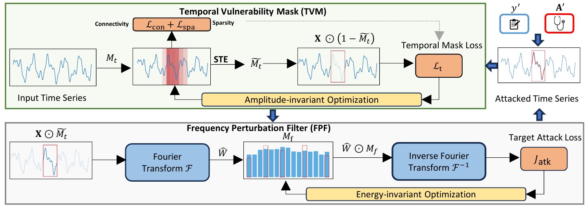

# TSEF: Time Series Explanation Fooler

This repository contains the official implementation of **TSEF (Time Series Explanation Fooler)**, a novel adversarial attack method for exposing vulnerabilities in explanation for time series classifiers.

<p align="center">
  
</p>


## Overview

TSEF Attack generates adversarial perturbations that fool both the classifier and the explainer. The attack operates in two phases:

1. **Temporal Mask (Mt) Optimization**: Localizes vulnerable temporal patterns
2. **Frequency Mask (Mf) Optimization**: Applies frequency-domain perturbations

## Key Features

- **Dual-target attack**: A dual-target attack that jointly manipulates the classifier and explainer outputs
- **Structured attack**: Decouple when to perturb (sparse, connected temporal mask) from how to perturb (frequency-domain filter) under a perturbation budget
- **Supports multiple explainers**: Works with mask-based (TimeX/TimeX++) and gradient-based (Integrated Gradients) explainers


## Installation

```bash
# Clone the repository
git clone https://github.com/Bohan7/TSEF.git
cd TSEF

# Install dependencies
pip install -r requirements.txt

# Install timesynth
cd timesynth-0.2.4/
pip install .
cd ..

# Install the package
python -m pip install -e .
```

## Datasets

All datasets can be downloaded from [Harvard Dataverse](https://doi.org/10.7910/DVN/B0DEQJ). Place the datasets in the `datasets/` directory.

Supported datasets:
- **Synthetic**: SeqCombSingle, LowVarDetect, SeqCombMV
- **Real-world**: Epilepsy, PAM, MITECG

## Usage

### Running TSEF Attack

The main attack script is located at `experiments/evaluation/tsef_attack.py`.

```bash
cd experiments/evaluation

# # Run TSEF attack with TimeX++ explainer
python tsef_attack.py \
    --dataset lowvardetect \
    --exp_method ours \
    --attack_name tsef_mask_attack \
    --attack 0.1 \
    --data_path /path/to/datasets \
    --model_path /path/to/timexpp/model.pt \
    --predictor_path /path/to/classifier.pt \
    --split_no 1 \
    --tsef_attack_iters 100 \
    --tsef_attack_k1 10 \
    --tsef_attack_k2 20 \
    --tsef_attack_lr_t 1.0 \
    --tsef_attack_lr_f 1.0 \
    --tsef_attack_r_mt 0.3 \
    --tsef_attack_beta_t 1.0 \
    --tsef_attack_gamma_t 1.0 \
    --tsef_attack_lambda_cls 0.05 \
    --tsef_attack_lambda_exp 1.0

# Run TSEF attack with TimeX explainer (add --is_timex flag)
python tsef_attack.py \
    --dataset lowvardetect \
    --exp_method ours \
    --attack_name tsef_mask_attack \
    --attack 0.1 \
    --data_path /path/to/datasets \
    --model_path /path/to/timex/model.pt \
    --predictor_path /path/to/classifier.pt \
    --split_no 1 \
    --is_timex \
    --tsef_attack_iters 100 \
    --tsef_attack_k1 10 \
    --tsef_attack_k2 20 \
    --tsef_attack_lr_t 1.0 \
    --tsef_attack_lr_f 1.0 \
    --tsef_attack_r_mt 0.3 \
    --tsef_attack_beta_t 1.0 \
    --tsef_attack_gamma_t 1.0 \
    --tsef_attack_lambda_cls 0.1 \
    --tsef_attack_lambda_exp 1.0

# Run TSEF attack with Integrated Gradients explainer
python tsef_attack.py \
    --dataset lowvardetect \
    --exp_method ig_batch \
    --attack_name tsef_mask_attack \
    --attack 0.1 \
    --data_path /path/to/datasets \
    --predictor_path /path/to/classifier.pt \
    --split_no 1 \
    --tsef_attack_iters 100 \
    --tsef_attack_k1 10 \
    --tsef_attack_k2 20 \
    --tsef_attack_lr_t 1.0 \
    --tsef_attack_lr_f 1.0 \
    --tsef_attack_r_mt 0.3 \
    --tsef_attack_beta_t 1.0 \
    --tsef_attack_gamma_t 1.0 \
    --tsef_attack_lambda_cls 0.005 \
    --tsef_attack_lambda_exp 1.0
```

### Key Parameters

| Parameter | Description | Default |
|-----------|-------------|---------|
| `--attack` | Perturbation budget (fraction of data range, e.g., 0.1 = 10%) | 0.1 |
| `--tsef_attack_iters` | Number of outer iterations | 100 |
| `--tsef_attack_k1` | Inner iterations for Mt optimization | 10 |
| `--tsef_attack_k2` | Inner iterations for Mf optimization | 20 |
| `--tsef_attack_lr_t` | Learning rate for temporal mask | 1.0 |
| `--tsef_attack_lr_f` | Learning rate for frequency mask | 1.0 |
| `--tsef_attack_r_mt` | Sparsity ratio for temporal mask | 0.3 |
| `--tsef_attack_beta_t` | Weight for sparsity loss | 1.0 |
| `--tsef_attack_gamma_t` | Weight for connectivity loss | 1.0 |
| `--tsef_attack_lambda_cls` | Weight for classification loss | 1.0 |
| `--tsef_attack_lambda_exp` | Weight for explanation loss | 1.0 |

### Training Classifiers and Explainers

Before running the attack, you need trained classifiers and explainers:

```bash
# Train classifier (transformer)
cd experiments/lowvardetect
python train_transformer.py

# Train explainer (TimeX++) - default
python bc_model_ptype.py
# Note: set is_timex=False at the beginning of bc_model_ptype.py

# Train explainer (TimeX)
python bc_model_ptype.py
# Note: set is_timex=True at the beginning of bc_model_ptype.py
```

### Reproducing Experiments

To reproduce all experiments of TSEF from the paper, use the scripts in the `scripts/` folder:

```bash
cd scripts

# Run experiments on a specific dataset
bash run_lowvar.sh      # LowVarDetect
bash run_epilepsy.sh    # Epilepsy
bash run_pam.sh         # PAM
bash run_mitecg.sh      # MITECG
bash run_seqcombmv.sh   # SeqCombMV
bash run_seqcombsingle.sh  # SeqCombSingle

# Run all experiments
bash run_all.sh
```

**Note**: Update the model paths in each script before running. See `scripts/README.md` for details.

## Project Structure

```
TSEF/
├── experiments/
│   ├── evaluation/
│   │   └── tsef_attack.py                     # Main attack script
│   ├── lowvardetect/                           # LowVarDetect dataset experiments
│   ├── seqcomb_mv/                             # SeqCombMV dataset experiments
│   └── ...                                     # Other dataset experiments
├── txai/
│   ├── models/
│   │   ├── bc_model.py                         # TimeX++ model
│   │   └── encoders/                           # Encoder architectures
│   └── utils/
│       ├── predictors/
│       │   ├── eval.py                         # Evaluation metrics
│       │   └── loss.py                         # Loss functions (GSATLoss, etc.)
│       └── evaluation.py                       # XAI evaluation metrics
├── datasets/                                   # Dataset files
├── requirements.txt
└── README.md
```

## Attack Methods

### `tsef_mask_attack`
For mask-based explainers (e.g., TimeX, TimeX++). Uses the explainer's saliency output as the target.

### `tsef_mask_attack_ig`
For gradient-based explainers (e.g., Integrated Gradients). Computes IG attributions during the attack loop.

## Evaluation Metrics

The attack evaluation includes:
- **AUPRC/AUP/AUR**: Alignment between attacked explanations and target explanations
- **F1 Score**: Classification accuracy on target class
- **ASR (Attack Success Rate)**: Rate of successful targeted attacks

## Requirements

- Python == 3.12.6
- PyTorch >= 2.0
- See `requirements.txt` for full dependencies

## License

This project is licensed under the MIT License.

## Acknowledgments

This codebase builds upon [TimeX](https://github.com/mims-harvard/TimeX) and [TimeX++](https://github.com/zichuan-liu/TimeXplusplus). We thank the original authors for their excellent work.
